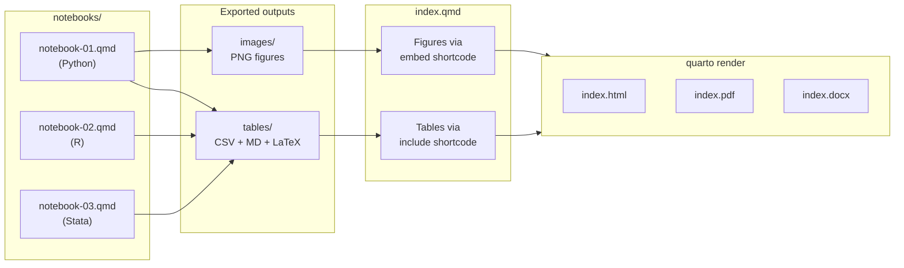
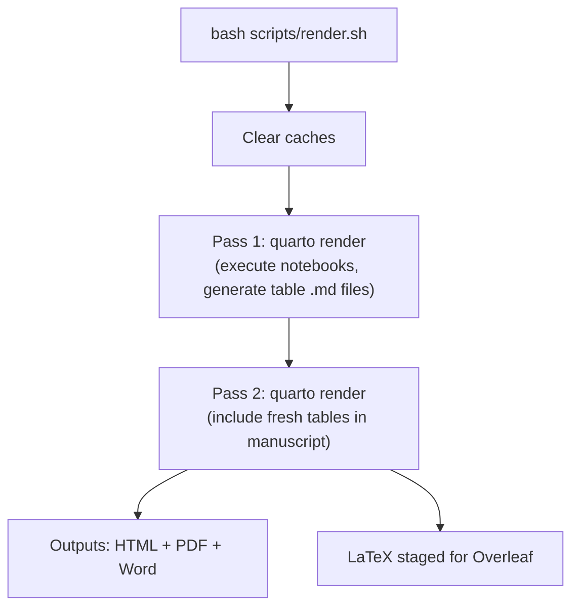
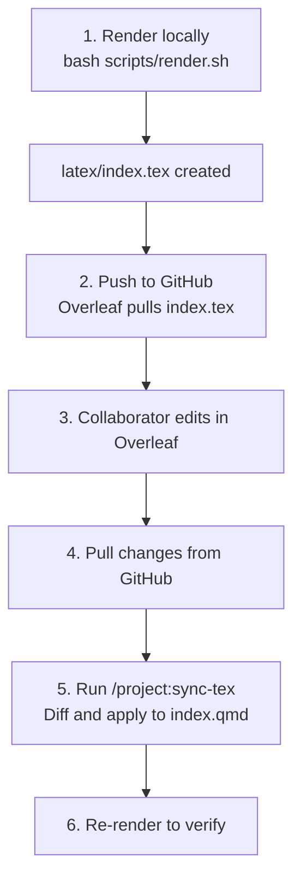

# [FILL: Project Title]

> **Template:** `project20XXy` — a reusable, multi-language research project template built on [Quarto](https://quarto.org/).

[FILL: One-paragraph description of the project — what question it investigates, why it matters, and what data/methods it uses.]

## What Is This Template?

`project20XXy` is a ready-to-clone template for reproducible academic research. It integrates:

- **Multi-language notebooks** — Python, R, and Stata in the same project, using Quarto notebooks (`.qmd`) — plain-text files with clean version control.
- **Quarto manuscript** — A single source file (`index.qmd`) that embeds figures and tables from notebooks and renders to HTML, PDF, and Word simultaneously.
- **Overleaf collaboration** — A sync workflow that lets LaTeX-only collaborators edit the manuscript in Overleaf while you keep working in Quarto.
- **Reproducibility by design** — Locked dependencies, protected raw data, and consistent random seeds.
- **AI-assisted workflow** — Claude Code integration with 24 skills for rendering, notebook creation, session handoffs, LaTeX sync, and more.

Clone this repository, fill in the `[FILL: ...]` placeholders, and start researching.

## Quick Start

```bash
# 1. Clone and enter the project
git clone [FILL: repository URL]
cd [FILL: project directory]

# 2. Install Python dependencies
uv sync

# 3. Render the manuscript (two-pass render: executes notebooks + builds HTML, PDF, Word)
bash scripts/render.sh

# 4. View the output
open _manuscript/index.html
```

> R and Stata kernels require additional setup — see [Installation](#installation) below.

---

## How It Works

Notebooks produce figures and tables. Figures are embedded directly in the manuscript via ``. Tables are exported as Markdown files and included via ``. Quarto renders everything into HTML, PDF, and Word.



> **Why two passes?** The `scripts/render.sh` script runs `quarto render` twice. The first pass executes notebooks (generating table `.md` files in `tables/`). The second pass picks up those fresh files via `` in the manuscript. A single `quarto render` may include stale table content.

---

## Requirements

| Tool | Purpose | Required? |
| ---- | ------- | --------- |
| [Quarto](https://quarto.org/) >= 1.4 | Manuscript rendering | Yes |
| [uv](https://docs.astral.sh/uv/) | Python package manager | Yes |
| Python 3.12+ | Notebooks, scripting | Yes |
| R | R notebooks | If using R |
| Stata | Stata notebooks | If using Stata |

Verify your setup:

```bash
quarto --version        # >= 1.4
uv --version            # any recent version
python3 --version       # >= 3.12
R --version             # optional
stata -v                # optional
```

---

## Installation

### Python Environment

```bash
uv sync    # Creates .venv/ with locked dependencies from uv.lock
```

This installs the core scientific stack (numpy, pandas, matplotlib, seaborn), the `pyfixest` econometrics package, and the `nbstata` Stata kernel. All Python commands should be prefixed with `uv run`.

### R Kernel (IRkernel)

```bash
R -e "install.packages(c('IRkernel', 'ggplot2', 'knitr', 'fixest'), repos='https://cloud.r-project.org')"
R -e "IRkernel::installspec()"
```

Verify: `jupyter kernelspec list` should show `ir`.

### Stata Kernel (nbstata)

> Use **nbstata**, not the legacy `stata_kernel` (which has a graph-capture bug with Stata 19+).

```bash
uv run python -m nbstata.install    # Register the kernel
```

Create `~/.config/nbstata/nbstata.conf`:

```ini
[nbstata]
stata_dir = /Applications/Stata
edition = se
```

Adjust `stata_dir` and `edition` (`be`, `se`, or `mp`) for your system. Verify: `jupyter kernelspec list` should show `nbstata`.

Install required Stata packages from a Stata session or notebook:

```stata
ssc install reghdfe
ssc install estout
```

### Adding Packages

| Language | Command | Notes |
| -------- | ------- | ----- |
| Python | `uv add <package>` | Updates `pyproject.toml` + `uv.lock`. Never use `pip install`. |
| R | `install.packages("pkg")` | System-level. Use [renv](https://rstudio.github.io/renv/) for isolation. |
| Stata | `ssc install <package>` | System-level `ado/plus/` directory. |

---

## Manuscript Workflow

### Writing

The manuscript lives in `index.qmd`. It uses standard Markdown with Quarto extensions:

- **Sections** with cross-reference IDs: `## Introduction {#sec-introduction}`
- **Citations** from `references.bib`: `@key` (narrative) or `[@key]` (parenthetical)
- **Figures** from notebooks: ``
- **Tables** from exported files: ``

### Rendering

```bash
# Recommended: two-pass clean render (all formats + Overleaf staging)
bash scripts/render.sh

# Quick single-notebook render (for development)
quarto render notebooks/notebook-01.qmd

# Single-format render
quarto render index.qmd --to html
```

The render script clears caches, runs `quarto render` twice (to pick up fresh table includes), and copies LaTeX to `latex/` for Overleaf.



---

## Notebook Workflow

### Content Structure

Each notebook is a **tutorial** that follows three sections:

1. **Data Import** — Load data, inspect panel structure, show dimensions
2. **Exploratory Data Analysis** — Descriptive statistics (initial vs final period), visualizations (box plots, scatter plots, correlation heatmap)
3. **Regression Analysis** — Fixed effects models with professional multi-column tables

Include pedagogical markdown text between code blocks explaining what the code does, why it matters, and how to interpret the output.

### Creating Notebooks

Use `/project:new-notebook` in Claude Code, or manually:

1. Create `notebooks/notebook-NN.qmd` with YAML frontmatter (`title` and `jupyter` kernel)
2. Set the random seed in the first code cell (see [Reproducibility](#reproducibility))
3. Register in `_quarto.yml` under `manuscript.notebooks`

### Exporting Figures

All figures: **6 inches wide x 4 inches tall**, 300 DPI.

| Language | Export command |
| -------- | ------------- |
| Python | `fig.savefig("../images/<label>.png", dpi=300, bbox_inches="tight")` |
| R | `ggsave("../images/<label>.png", plot = p, width = 6, height = 4, dpi = 300)` |
| Stata | `quietly graph export "../images/<label>.png", replace width(1800)` |

### Exporting Tables

Every table must be exported in **three formats**: CSV, Markdown, and LaTeX.

| Format | Python | R | Stata |
| ------ | ------ | - | ----- |
| CSV | `df.to_csv("../tables/<label>.csv")` | `write.csv(result, "../tables/<label>.csv")` | `export delimited` |
| Markdown | `df.to_markdown()` → write to `.md` | `knitr::kable(format = "pipe")` → write to `.md` | `file write` |
| LaTeX | `df.to_latex("../tables/<label>.tex")` | `knitr::kable(format = "latex", booktabs = TRUE)` → write to `.tex` | `file write` with booktabs |

### Embedding in the Manuscript

**Figures** use `` — Quarto extracts the figure output from the notebook:

```markdown

```

**Tables** use `` — Quarto includes the exported Markdown file:

```markdown
**Table 1: Descriptive statistics.**



::: {.table-notes}
*Note:* Explanation of variables, units, and data source.
:::
```

> **Why different methods?** Quarto's `` works well for figures (image outputs) but cannot reliably extract markdown display outputs from notebook cells. Tables are exported as `.md` files and included directly, which renders correctly in HTML, PDF, and Word.

### Regression Tables

Build multi-column regression tables **manually as pipe-delimited Markdown**. Do not use `pf.etable(type="md")`, `etable(markdown=TRUE)`, or `esttab md` — their output does not render correctly in the Quarto manuscript.

A typical regression table includes:

- Header row with column numbers and model names
- Coefficient with significance stars (\*\*\* p<0.01, \*\* p<0.05, \* p<0.10)
- Standard errors in parentheses
- Separator row between coefficients and metadata
- Fixed effects indicators (Yes/No)
- Observations and R-squared
- Table notes explaining clustering and significance conventions

See the existing notebooks for complete working examples.

---

## Overleaf Collaboration

For collaborators who prefer LaTeX, the project supports a sync workflow with [Overleaf](https://www.overleaf.com/) via GitHub integration.



### Constraints

- **Prose only** — Only text edits are transferred. `` shortcodes are preserved.
- **Captions are not synced** — Figure/table captions live in notebook cells.
- **Preamble is ignored** — Everything before `\begin{document}` is auto-generated by Quarto.

---

## Reproducibility

### Seeds

Set the random seed in the first code cell of every notebook:

| Language | Code |
| -------- | ---- |
| Python | `random.seed(42)` and `np.random.seed(42)` |
| R | `set.seed(42)` |
| Stata | `set seed 42` |

### Dependencies

- **Python:** Locked via `uv` (`pyproject.toml` + `uv.lock`)
- **R:** System library or [renv](https://rstudio.github.io/renv/) for isolation
- **Stata:** System `ado/` directory

### Credentials

API keys and secrets go in `.env` (gitignored). Never commit `.env` to git.

---

## Project Structure

### Directories

| Directory | Purpose |
| --------- | ------- |
| `notebooks/` | Quarto notebooks (`.qmd`) in Python, R, and Stata |
| `data/` | Datasets (`panel_growth.csv` is the sample panel dataset) |
| `data/rawData/` | Raw source data — **never modify** |
| `images/` | Exported figures (PNG, 6x4 inches, 300 DPI) |
| `tables/` | Exported tables (CSV + Markdown + LaTeX) |
| `code/` | Standalone scripts outside notebooks |
| `latex/` | Overleaf sync staging (`index.tex` + `.baseline.tex`) |
| `slides/` | Quarto revealjs presentations |
| `references/` | Annotated bibliography notes |
| `notes/` | Research notes and brainstorming |
| `scripts/` | Build utilities (`render.sh`) |
| `handoffs/` | Session handoff reports (`YYYYMMDD_HHMM.md`) |
| `legacy/` | Archived old files (never deleted, always moved here) |
| `_manuscript/` | Rendered outputs — **auto-generated**, gitignored |

### Root-Level Files

| File | Purpose |
| ---- | ------- |
| `index.qmd` | Main manuscript source |
| `_quarto.yml` | Quarto config (formats, notebooks, theme: `cosmo`, highlight: `github`) |
| `styles.css` | Custom HTML styling (tables, code blocks, notebook layout) |
| `references.bib` | BibTeX bibliography (from Zotero) |
| `pyproject.toml` | Python dependencies (includes `pyfixest`, `nbstata`) |
| `uv.lock` | Locked dependency versions (auto-generated) |
| `.python-version` | Pins Python to 3.12 |
| `.gitignore` | Git ignore rules |
| `.env` | API keys and secrets (**gitignored**) |
| `CLAUDE.md` | Instructions for Claude Code AI assistant |

---

## Customizing This Template

After cloning for a new project:

1. **`README.md`** — Replace all `[FILL:]` placeholders
2. **`index.qmd`** — Set title, authors, abstract, keywords
3. **`pyproject.toml`** — Update `name`, `description`, `authors`
4. **`CLAUDE.md`** — Fill in the Project Context table
5. **`_quarto.yml`** — Update notebook titles as you add new notebooks

Search for remaining placeholders:

```bash
grep -r "\[FILL:" --include="*.md" --include="*.qmd" --include="*.toml" .
```

### Theme and Styling

The HTML output uses the `cosmo` Bootstrap theme with `github` syntax highlighting. To change:

```yaml
# In _quarto.yml
format:
  html:
    theme: cosmo              # Try: flatly, journal, lux, simplex
    highlight-style: github    # Try: atom-one, dracula, nord, monokai
    css: styles.css            # Custom table and code block styling
```

---

## Workflow with Claude Code

This template includes [Claude Code](https://claude.com/claude-code) integration with 24 skills. Type `/project:<name>` to invoke.

### Available Skills

| Category | Skills |
| -------- | ------ |
| **Build & Execution** | `/project:render`, `/project:execute`, `/project:init`, `/project:sync-tex` |
| **Notebook Creation** | `/project:new-notebook`, `/project:new-analysis`, `/project:new-slide-deck` |
| **Writing & Results** | `/project:draft-section`, `/project:abstract`, `/project:interpret-results`, `/project:regression-table`, `/project:robustness-table`, `/project:referee-response` |
| **References & Data** | `/project:cite`, `/project:literature-note`, `/project:codebook` |
| **Quality Checks** | `/project:bib-check`, `/project:data-audit`, `/project:freeze-check`, `/project:check-env`, `/project:submission-prep`, `/project:figures-gallery` |
| **Session Management** | `/project:handoff`, `/project:env-snapshot` |

Skills are defined in [`.claude/skills/`](.claude/skills/). Each has a `SKILL.md` with instructions and YAML frontmatter.

### Session Continuity

Handoff reports in `handoffs/` preserve context across sessions. Each report includes the project state, work completed, decisions made, and next steps. Claude reads the most recent handoff at the start of every session.
