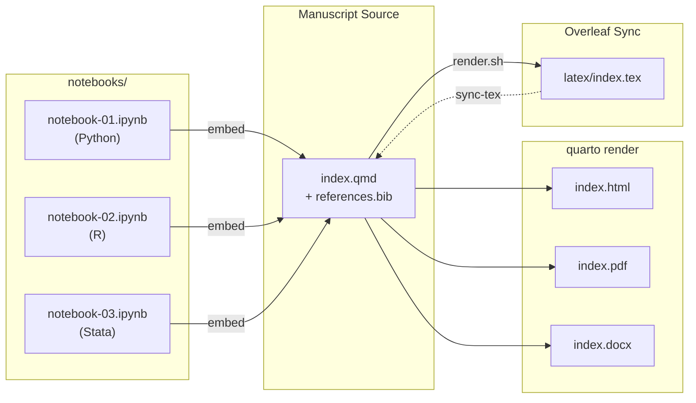
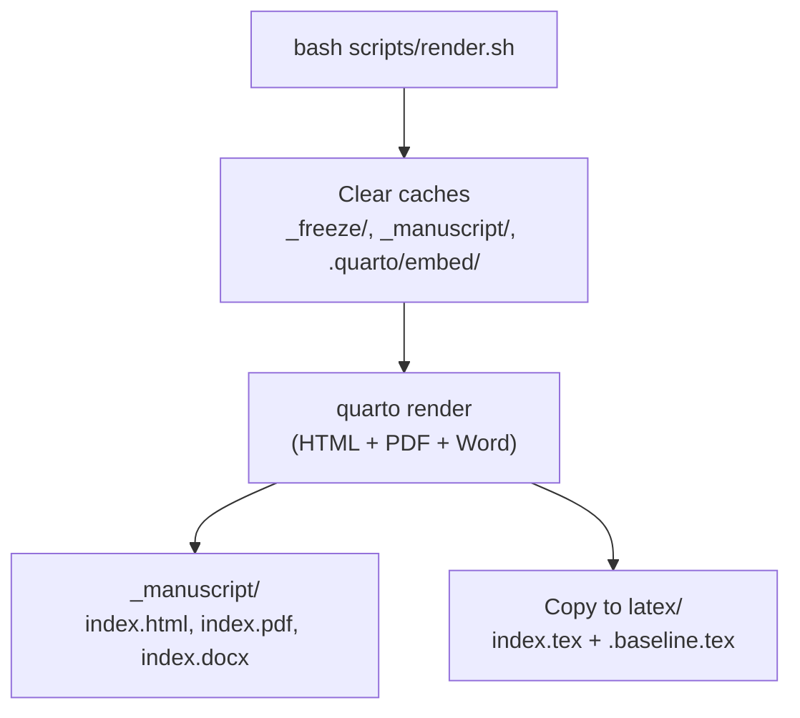
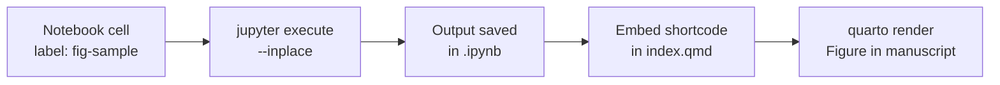
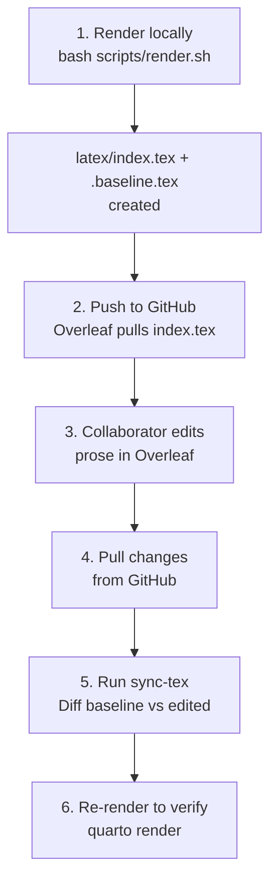

# [FILL: Project Title]

> **Template:** `project20XXy` — a reusable, multi-language research project template built on [Quarto](https://quarto.org/).

[FILL: One-paragraph description of the project — what question it investigates, why it matters, and what data/methods it uses.]

## What Is This Template?

`project20XXy` is a ready-to-clone template for reproducible academic research. It integrates:

- **Multi-language notebooks** — Python, R, and Stata in the same project, each with Jupyter notebooks paired to Markdown files for clean version control.
- **Quarto manuscript** — A single source file (`index.qmd`) that embeds figures and tables from notebooks and renders to HTML, PDF, and Word simultaneously.
- **Overleaf collaboration** — A sync workflow that lets LaTeX-only collaborators edit the manuscript in Overleaf while you keep working in Quarto.
- **Reproducibility by design** — Shared seed configuration, locked dependencies, and raw data protection built into the project structure.
- **AI-assisted workflow** — Claude Code integration with slash commands for rendering, notebook creation, session handoffs, and LaTeX sync.

Clone this repository, fill in the `[FILL: ...]` placeholders, and start researching.

## Quick Start

```bash
# 1. Clone and enter the project
git clone [FILL: repository URL]
cd [FILL: project directory]

# 2. Install Python dependencies
uv sync

# 3. Execute the sample notebooks
uv run jupyter execute --inplace notebooks/notebook-01.ipynb
uv run jupyter execute --inplace notebooks/notebook-02.ipynb
uv run jupyter execute --inplace notebooks/notebook-03.ipynb

# 4. Render the manuscript (HTML + PDF + Word)
quarto render

# 5. View the output
open _manuscript/index.html
```

> R and Stata kernels require additional setup — see [Installation](#installation) below.

---

## How It Works

The diagram below shows how the pieces fit together. Notebooks produce labeled figures and tables, the manuscript embeds them, and Quarto renders everything into final outputs. Collaborators who prefer LaTeX can edit via Overleaf, and their changes sync back into the Quarto source.



---

## Customizing This Template

After cloning this repository for a new project, update these files:

1. **`README.md`** — Replace all `[FILL:]` placeholders (title, description, objectives, methods, data)
2. **`index.qmd`** — Set the manuscript title, authors, affiliations, abstract, and keywords
3. **`pyproject.toml`** — Update `name`, `description`, and `authors`
4. **`CLAUDE.md`** — Fill in the Project Context table (title, authors, stage, data source)
5. **`_quarto.yml`** — Update notebook titles as you add new notebooks

Search for all remaining placeholders:

```bash
grep -r "\[FILL:" --include="*.md" --include="*.qmd" --include="*.toml" .
```

---

## Requirements

| Tool | Purpose | Required? |
| ---- | ------- | --------- |
| [Quarto](https://quarto.org/) >= 1.4 | Manuscript rendering | Yes |
| [uv](https://docs.astral.sh/uv/) | Python package manager | Yes |
| Python 3.12+ | Notebooks, scripting | Yes |
| R | R notebooks | If using R |
| Stata | Stata notebooks | If using Stata |

Verify your setup (all commands should return version numbers):

```bash
quarto --version        # >= 1.4
uv --version            # any recent version
python3 --version       # >= 3.12
R --version             # optional, for R notebooks
stata -v                # optional, for Stata notebooks
```

---

## Installation

### Python Environment

```bash
# Create virtual environment and install all dependencies
uv sync

# The Python Jupyter kernel is installed automatically
```

This creates a `.venv/` with locked dependencies from `uv.lock`. All Python commands should be prefixed with `uv run` to use this environment (e.g., `uv run jupyter notebook`).

### R Kernel (IRkernel)

```bash
R -e "install.packages(c('IRkernel', 'ggplot2', 'knitr'), repos='https://cloud.r-project.org')"
R -e "IRkernel::installspec()"
```

Verify: `jupyter kernelspec list` should show `ir`.

### Stata Kernel (nbstata)

> **Important:** Use **nbstata**, not the legacy `stata_kernel` (which has a graph-capture bug).

```bash
pip install nbstata
python -m nbstata.install
```

Then create the configuration file at `~/.config/nbstata/nbstata.conf`:

```ini
[nbstata]
stata_dir = /Applications/Stata
edition = se
```

Adjust `stata_dir` and `edition` for your OS and Stata version (`be`, `se`, or `mp`). See [notebooks/README.md](notebooks/README.md) for platform-specific paths.

Verify: `jupyter kernelspec list` should show `nbstata`.

### Installing Packages

Each language has its own package manager. To ensure packages are available inside the correct notebook kernel, use the commands below.

**Python** — managed by `uv`, which keeps `pyproject.toml` and `uv.lock` in sync:

```bash
uv add numpy pandas          # Add packages (updates pyproject.toml + uv.lock)
uv remove pandas             # Remove a package
uv sync                      # Reinstall from lockfile (e.g., after pulling)
```

All packages installed by `uv` are available in the project's `.venv/`, which is the same environment the Python Jupyter kernel uses. Never use `pip install` directly — it bypasses the lockfile.

**R** — use `install.packages()` from an R session:

```r
install.packages(c("dplyr", "tidyr"), repos = "https://cloud.r-project.org")
```

R packages are installed into your system or user R library, which the IR kernel picks up automatically. For project-level isolation, consider using [renv](https://rstudio.github.io/renv/).

**Stata** — packages are installed via `ssc install` or `net install` from within a Stata session or notebook cell:

```stata
ssc install estout
ssc install reghdfe
net install ftools, from("https://raw.githubusercontent.com/sergiocorreia/ftools/master/src/")
```

Stata packages are installed into your system Stata `ado/plus/` directory, which the nbstata kernel uses directly. No additional configuration is needed.

---

## Manuscript Workflow

### Writing

The manuscript lives in `index.qmd`. It uses standard Markdown with Quarto extensions:

- **Sections** with cross-reference IDs: `## Introduction {#sec-introduction}`
- **Citations** from `references.bib`: `@key` (narrative) or `[@key]` (parenthetical)
- **Embedded outputs** from notebooks: ``

You write prose in `index.qmd` and keep computational work in the notebooks. The embed shortcodes pull figures and tables from notebooks into the manuscript at render time.

### Rendering

```bash
# Render all formats (HTML, PDF, Word) → outputs in _manuscript/
quarto render

# Render a single format
quarto render index.qmd --to html
quarto render index.qmd --to pdf
quarto render index.qmd --to docx

# Clean render (clears all caches first, also stages LaTeX for Overleaf)
bash scripts/render.sh
```

The clean render script (`scripts/render.sh`) removes `_freeze/`, `_manuscript/`, and `.quarto/embed/` before rendering, ensuring a fresh build. It also copies the generated LaTeX to `latex/` for the Overleaf workflow.



---

## Notebook Workflow

### Creating Notebooks

Notebooks follow sequential naming: `notebook-01.ipynb`, `notebook-02.ipynb`, etc. Each notebook is paired with a `.md:myst` file via [Jupytext](https://jupytext.readthedocs.io/) — the `.ipynb` is for execution, and the `.md` is for version control (clean diffs in git).

To create a new notebook, use the Claude Code command `/project:new-notebook`, or manually:

1. Create the `.ipynb` with the appropriate kernel (Python, R, or Stata)
2. Add a setup cell that loads the reproducibility config (see [Reproducibility](#reproducibility))
3. Pair it with Jupytext: `uv run jupytext --set-formats ipynb,md:myst notebooks/notebook-04.ipynb`
4. Register it in `_quarto.yml` under `manuscript.notebooks`

### Executing Notebooks

Notebooks must be executed before rendering the manuscript (so their outputs are available for embedding):

```bash
# Execute a notebook (--inplace is required to save outputs back to the file)
uv run jupyter execute --inplace notebooks/notebook-01.ipynb

# After editing the .ipynb interactively, sync the .md pair
uv run jupytext --sync notebooks/notebook-01.ipynb

# After editing the .md file directly, sync the .ipynb pair
uv run jupytext --sync notebooks/notebook-01.md
```

> **Important:** The `--inplace` flag is required for `jupyter execute`. Without it, outputs are discarded.

### Embedding Outputs in the Manuscript

To embed a figure or table from a notebook into `index.qmd`, you need two things:

**1. A labeled cell in the notebook:**

For Python or R cells, use the `#|` (hash-pipe) prefix:

```python
#| label: fig-my-plot
#| fig-cap: "Descriptive caption for the figure"
import matplotlib.pyplot as plt
plt.plot(x, y)
plt.show()
```

For Stata cells, use the `*|` (star-pipe) prefix (because `*` is Stata's comment character):

```stata
*| label: fig-stata-scatter
*| fig-cap: "Stata scatter plot"
twoway scatter y x
```

> **Stata restriction:** Do NOT use the `tbl-` label prefix for Stata cells that produce text output (e.g., `tabstat`, `summarize`). The `tbl-` prefix triggers Quarto's table parser, which crashes on Stata's plain-text output. Use a plain label instead (e.g., `stata-summary`).

**2. An embed shortcode in `index.qmd`:**

```markdown

```

The label after `#` must match the cell label exactly.



---

## Overleaf Collaboration

For collaborators who prefer editing in LaTeX, the project supports a sync workflow with [Overleaf](https://www.overleaf.com/) via GitHub integration.

### Workflow Overview



### Step by Step

1. **Render** — Run `bash scripts/render.sh` to generate `latex/index.tex` (the file Overleaf will use) and `latex/.baseline.tex` (a local-only snapshot for diffing later).
2. **Push** — Push to GitHub. Overleaf's GitHub sync pulls `latex/index.tex`.
3. **Collaborator edits** — Your collaborator edits the manuscript body in Overleaf.
4. **Pull** — After the collaborator pushes from Overleaf, pull the changes back to your local repo.
5. **Transfer** — Run `/project:sync-tex` (Claude Code command) to diff the baseline against the edited file and apply prose changes to `index.qmd`. LaTeX formatting is automatically converted:

   | LaTeX | Quarto Markdown |
   | ----- | --------------- |
   | `\textbf{text}` | `**text**` |
   | `\emph{text}` | `*text*` |
   | `\citep{key}` | `[@key]` |
   | `\citet{key}` | `@key` |
   | `\footnote{text}` | `^[text]` |
   | `\href{url}{text}` | `[text](url)` |

6. **Re-render** — Run `quarto render` to verify everything renders cleanly.

### Constraints

- **Prose only** — Only text edits in the manuscript body are transferred. `` shortcodes are preserved exactly as-is.
- **Captions are not synced** — Figure and table captions live in notebook cells and cannot be recovered from the compiled LaTeX.
- **Preamble is ignored** — Everything before `\begin{document}` is auto-generated by Quarto. Collaborator edits to the preamble are discarded.
- **Baseline is local** — `latex/.baseline.tex` is gitignored. Each collaborator diffs against their own last render.

---

## Reproducibility

### Seeds and Configuration

Every notebook should call `set_seeds()` in its first cell to ensure reproducible results:

**Python:**

```python
import sys; sys.path.insert(0, "..")
from config import set_seeds, DATA_DIR, IMAGES_DIR
set_seeds()  # sets random, numpy, and PYTHONHASHSEED to 42
```

**R:**

```r
source("../config.R")
set_seeds()  # sets seed to 42 with L'Ecuyer-CMRG RNG
```

**Stata:**

```stata
clear all
set seed 42
```

The configuration files (`config.py` and `config.R`) also provide standardized project paths (`DATA_DIR`, `RAW_DATA_DIR`, `IMAGES_DIR`, `TABLES_DIR`, etc.) resolved dynamically from the project root — no hardcoded paths.

### Dependencies

Python dependencies are locked via `uv` (`pyproject.toml` + `uv.lock`), R packages use the system library (or `renv` for isolation), and Stata packages are installed into the system `ado/` directory. See [Installing Packages](#installing-packages) for commands.

### Credentials

API keys and secrets go in `.env` (gitignored). Never store secrets anywhere else. Never commit `.env` to git.

---

## References and Citations

References are managed with [Zotero](https://www.zotero.org/) and exported to `references.bib` at the project root.

In `index.qmd`, cite with standard Pandoc syntax:

```markdown
As shown by @key            # narrative: "As shown by Author (2024)"
As shown in the data [@key] # parenthetical: "As shown in the data (Author, 2024)"
```

Annotation notes on papers can be stored as Markdown files in `references/`.

---

## Presentations

Slide decks are built with Quarto (revealjs format) in the `slides/` directory. See [slides/README.md](slides/README.md) for the style guide, color conventions, and naming patterns.

```bash
# Render a presentation
quarto render slides/your-presentation.qmd
```

---

## Project Structure

### Directories

| Directory | Purpose | Key Contents |
| --------- | ------- | ------------ |
| `notebooks/` | Computational notebooks | `.ipynb` + `.md:myst` pairs (Python, R, Stata). Outputs are embedded in the manuscript via ``. See [notebooks/README.md](notebooks/README.md). |
| `data/` | Processed datasets | Transformed data produced by notebooks or scripts. |
| `data/rawData/` | Raw source data | **Never modify these files.** This is the source of truth for all analyses. |
| `code/` | Standalone scripts | R, Python, or Stata scripts that run outside notebooks. |
| `images/` | Figures and plots | Output figures. Naming convention: `fig01-description.png`. |
| `tables/` | Output tables | LaTeX, CSV, or other table formats. Naming: `tab01-description.csv`. |
| `latex/` | Overleaf sync staging | `index.tex` (tracked, shared with Overleaf) + `.baseline.tex` (gitignored, for diffing). See [Overleaf Collaboration](#overleaf-collaboration). |
| `slides/` | Quarto presentations | Revealjs slide decks. See [slides/README.md](slides/README.md). |
| `references/` | Annotated bibliography | Markdown notes on papers cited in the project. |
| `notes/` | Research notes | Brainstorming, ideas, meeting notes. |
| `templates/` | LaTeX template | Alternative `chadManuscript` template for standalone LaTeX use. |
| `scripts/` | Build utilities | `render.sh` — clean render pipeline with Overleaf staging. |
| `handoffs/` | Session logs | Timestamped Markdown reports (`YYYYMMDD_HHMM.md`) for cross-session continuity. |
| `legacy/` | Archived materials | Old versions of files moved here instead of being deleted. |
| `_manuscript/` | Rendered outputs | **Auto-generated** (gitignored). Contains HTML, PDF, Word, and notebook preview pages. |
| `.claude/commands/` | Claude Code skills | Slash commands: `/project:render`, `/project:new-notebook`, `/project:handoff`, `/project:sync-tex`. |

### Root-Level Files

| File | What It Does | When to Edit |
| ---- | ------------ | ------------ |
| `index.qmd` | Main manuscript source — prose, section structure, embed shortcodes, bibliography | When writing or editing the manuscript |
| `_quarto.yml` | Quarto project configuration — output formats, notebook registrations, render settings | When adding new notebooks or changing output settings |
| `references.bib` | BibTeX bibliography (exported from Zotero) | When adding or updating references |
| `pyproject.toml` | Python project metadata and dependencies | When adding Python packages (`uv add`) |
| `uv.lock` | Locked dependency versions (auto-generated by `uv`) | Never edit manually — updated by `uv sync` / `uv add` |
| `config.py` | Python reproducibility config — seed (42), project paths | Rarely — only if adding new path constants |
| `config.R` | R reproducibility config — seed (42), project paths | Rarely — only if adding new path constants |
| `jupytext.toml` | Jupytext pairing configuration | Rarely — pairing is set per-notebook in metadata |
| `.python-version` | Pins Python to 3.12 for `uv` | Only if upgrading Python |
| `.gitignore` | Git ignore rules | When adding new file types to exclude |
| `.env` | API keys and secrets (**gitignored**) | When adding credentials (never commit this file) |
| `CLAUDE.md` | Instructions for Claude Code AI assistant | When updating project context or AI workflow rules |

---

## Data

[FILL: Describe the data sources, how to obtain them, and where to place raw files in `data/rawData/`.]

---

## Workflow with Claude Code

This template includes [Claude Code](https://claude.com/claude-code) integration for AI-assisted research workflows. The `CLAUDE.md` file provides project context and behavioral rules for the AI assistant.

### Available Commands

| Command | What It Does |
| ------- | ------------ |
| `/project:render` | Clean render of the manuscript (HTML + PDF + Word) |
| `/project:new-notebook` | Create a new notebook with Jupytext pairing and register it in `_quarto.yml` |
| `/project:handoff` | Write a session handoff report to `handoffs/` |
| `/project:sync-tex` | Transfer collaborator LaTeX edits from Overleaf back into `index.qmd` |

### Session Continuity

Handoff reports in `handoffs/` preserve context across sessions. Each report includes the project state, work completed, decisions made, and next steps. Claude reads the most recent handoff at the start of every session to pick up where the last session left off.
