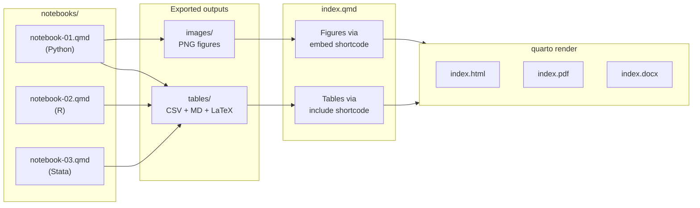
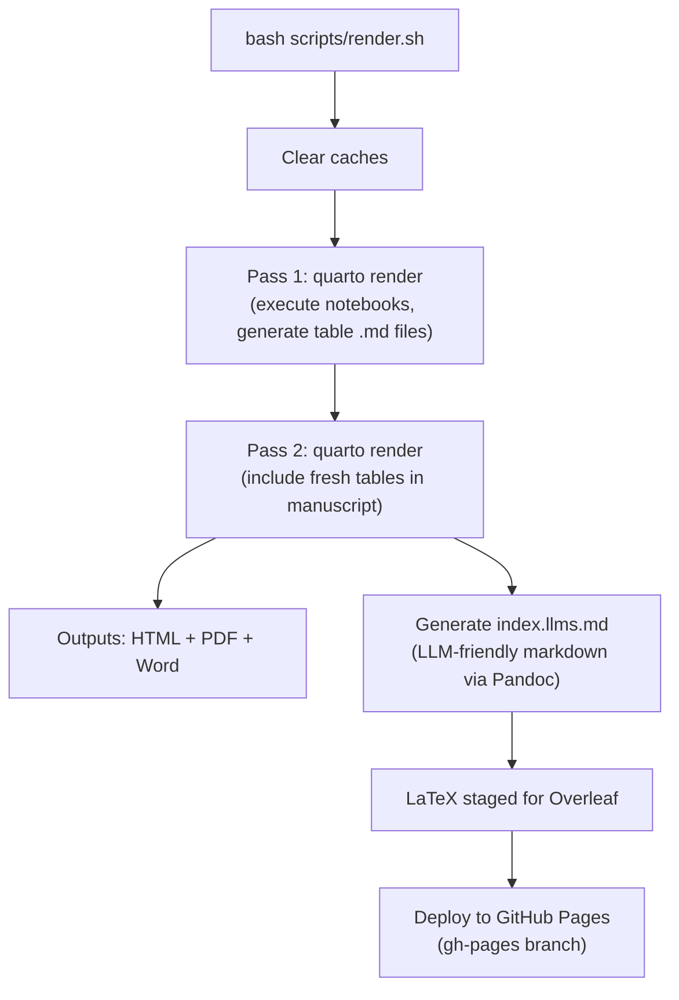
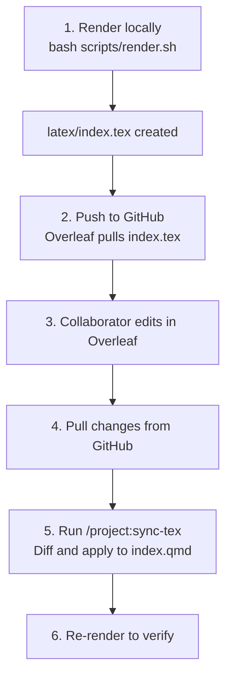

# [FILL: Project Title]

> **Template:** `project20XXy` — a reusable, multi-language research project template built on [Quarto](https://quarto.org/).

[FILL: One-paragraph description of the project — what question it investigates, why it matters, and what data/methods it uses.]

## Contents

- [What Is This Template?](#what-is-this-template)
- [Quick Start](#quick-start)
- [Using This Template](#using-this-template)
- [How It Works](#how-it-works)
- [Requirements](#requirements)
- [Installation](#installation)
- [Manuscript Workflow](#manuscript-workflow)
- [Notebook Workflow](#notebook-workflow)
- [Review & Audit Trail](#review--audit-trail)
- [Overleaf Collaboration](#overleaf-collaboration)
- [Publishing: GitHub Pages & LLM Outputs](#publishing-github-pages--llm-outputs)
- [Reproducibility](#reproducibility)
- [Project Structure](#project-structure)
- [Customizing This Template](#customizing-this-template)
- [Workflow with Claude Code](#workflow-with-claude-code)
- [Troubleshooting & FAQ](#troubleshooting--faq)
- [License](#license)

## What Is This Template?

`project20XXy` is a ready-to-clone template for reproducible academic research. It integrates:

- **Multi-language notebooks** — Python, R, and Stata in the same project, using Quarto notebooks (`.qmd`) — plain-text files with clean version control.
- **Quarto manuscript** — A single source file (`index.qmd`) that embeds figures and tables from notebooks and renders to HTML, PDF, and Word simultaneously.
- **Overleaf collaboration** — A sync workflow that lets LaTeX-only collaborators edit the manuscript in Overleaf while you keep working in Quarto.
- **Reproducibility by design** — Locked dependencies, protected raw data, and consistent random seeds.
- **AI-assisted workflow** — Claude Code integration with 14 skills (5 mode-based pipeline skills + 9 infra/utility skills) for analysis, writing, tables, literature, review, rendering, session handoffs, LaTeX sync, and more.

Clone this repository, fill in the `[FILL: ...]` placeholders, and start researching.

## Quick Start

```bash
# 1. Clone and enter the project
git clone [FILL: repository URL]
cd [FILL: project directory]

# 2. Install Python dependencies
uv sync

# 3. Render the manuscript (two-pass render: executes notebooks + builds HTML, PDF, Word)
bash scripts/render.sh

# 4. View the output
open _manuscript/index.html
```

> R and Stata kernels require additional setup — see [Installation](#installation) below.

---

## Using This Template

If you've just forked or cloned this repo and want to turn it into your own project, run through the checklist below in order. Each step links to a deeper section if you need details.

1. **Install the toolchain.** Quarto >= 1.8, `uv`, Python 3.12, and (optionally) R + Stata. See [Requirements](#requirements).
2. **Install Python deps.** `uv sync`. See [Python Environment](#python-environment).
3. **Install kernels you'll use.** [R kernel](#r-kernel-irkernel) and/or [Stata kernel](#stata-kernel-nbstata). Skip either if you don't need it — the pipeline runs with Python alone.
4. **Verify the environment.** In Claude Code, run `/project:check-env` to confirm every required tool and kernel is reachable.
5. **Render once from a clean clone** to confirm everything works end-to-end:

   ```bash
   bash scripts/render.sh
   open _manuscript/index.html
   ```

   You should see the demo manuscript render with all figures and tables.

6. **Fill in your project metadata.** Run `/project:init`, or edit by hand:
   - `README.md` — replace `[FILL: …]` placeholders at the top
   - `index.qmd` — set title, authors, abstract, keywords in the YAML header
   - `CLAUDE.md` — complete the **Project Context** table (Title, Authors, Stage, Data source)
   - `pyproject.toml` — update `name`, `description`, `authors`

   Find remaining placeholders at any time:

   ```bash
   grep -r "\[FILL:" --include="*.md" --include="*.qmd" --include="*.toml" .
   ```

7. **Bring in your data.** Put raw inputs in `data/rawData/` (never modified afterwards per CLAUDE.md rule #3) and document provenance in `data/rawData/README.md`. The demo `data/panel_growth.csv` is synthetic — move it to `legacy/` when you replace it.
8. **Replace or repurpose the sample notebooks.** The three notebooks in `notebooks/` are a panel-FE tutorial in Python, R, and Stata against the synthetic panel. Keep them as a reference, replace them with your analyses via `/project:analyze notebook` (or a method mode like `/project:analyze did`), and register anything new in `_quarto.yml` under `manuscript.notebooks`.
9. **Clear the template's session history.** Archive or delete everything in `handoffs/` so forkers start with their own context.
10. **Populate `references.bib`** from Zotero (or add entries one at a time with `/project:literature cite`). Run `/project:literature check` to catch orphan / missing citations.

Once these are done, the remaining sections below (Manuscript Workflow, Notebook Workflow, Overleaf Collaboration, Reproducibility) describe the day-to-day loop.

---

## How It Works

Notebooks produce figures and tables. Figures are embedded directly in the manuscript via ``. Tables are exported as Markdown files and included via ``. Quarto renders everything into HTML, PDF, and Word.


```mermaid
flowchart LR
    subgraph Notebooks ["notebooks/"]
        NB1["notebook-01.qmd<br/>(Python)"]
        NB2["notebook-02.qmd<br/>(R)"]
        NB3["notebook-03.qmd<br/>(Stata)"]
    end

    subgraph Exports ["Exported outputs"]
        IMG["images/<br/>PNG figures"]
        TBL["tables/<br/>CSV + MD + LaTeX"]
    end

    subgraph Manuscript ["index.qmd"]
        EMB["Figures via<br/>embed shortcode"]
        INC["Tables via<br/>include shortcode"]
    end

    subgraph Output ["quarto render"]
        HTML["index.html"]
        PDF["index.pdf"]
        DOCX["index.docx"]
    end

    NB1 --> IMG
    NB1 --> TBL
    NB2 --> TBL
    NB3 --> TBL
    IMG --> EMB
    TBL --> INC
    EMB --> Output
    INC --> Output
```

> **Why two passes?** The `scripts/render.sh` script runs `quarto render` twice. The first pass executes notebooks (generating table `.md` files in `tables/`). The second pass picks up those fresh files via `` in the manuscript. A single `quarto render` may include stale table content.

---

## Requirements

| Tool | Purpose | Required? |
| ---- | ------- | --------- |
| [Quarto](https://quarto.org/) >= 1.8 (tested with 1.8.27) | Manuscript rendering | Yes |
| [uv](https://docs.astral.sh/uv/) | Python package manager | Yes |
| Python 3.12+ | Notebooks, scripting | Yes |
| R | R notebooks | If using R |
| Stata | Stata notebooks | If using Stata |

Verify your setup:

```bash
quarto --version        # >= 1.8 (tested with 1.8.27)
uv --version            # any recent version
python3 --version       # >= 3.12
R --version             # optional
stata -v                # optional
```

---

## Installation

### Python Environment

```bash
uv sync    # Creates .venv/ with locked dependencies from uv.lock
```

This installs the core scientific stack (numpy, pandas, matplotlib, seaborn), the `pyfixest` econometrics package, and the `nbstata` Stata kernel. All Python commands should be prefixed with `uv run`.

### R Kernel (IRkernel)

```bash
R -e "install.packages(c('IRkernel', 'ggplot2', 'knitr', 'fixest'), repos='https://cloud.r-project.org')"
R -e "IRkernel::installspec()"
```

Verify: `jupyter kernelspec list` should show `ir`.

### Stata Kernel (nbstata)

> Use **nbstata**, not the legacy `stata_kernel` (which has a graph-capture bug with Stata 19+).

```bash
uv run python -m nbstata.install    # Register the kernel
```

Create `~/.config/nbstata/nbstata.conf`:

```ini
[nbstata]
stata_dir = /Applications/Stata
edition = se
```

Adjust `stata_dir` and `edition` (`be`, `se`, or `mp`) for your system. Verify: `jupyter kernelspec list` should show `nbstata`.

Install required Stata packages from a Stata session or notebook:

```stata
ssc install reghdfe
ssc install estout
```

### Adding Packages

| Language | Command | Notes |
| -------- | ------- | ----- |
| Python | `uv add <package>` | Updates `pyproject.toml` + `uv.lock`. Never use `pip install`. |
| R | `install.packages("pkg")` | System-level. Use [renv](https://rstudio.github.io/renv/) for isolation. |
| Stata | `ssc install <package>` | System-level `ado/plus/` directory. |

---

## Manuscript Workflow

### Writing

The manuscript lives in `index.qmd`. It uses standard Markdown with Quarto extensions:

- **Sections** with cross-reference IDs: `## Introduction {#sec-introduction}`
- **Citations** from `references.bib`: `@key` (narrative) or `[@key]` (parenthetical)
- **Figures** from notebooks: ``
- **Tables** from exported files: ``

### Rendering

```bash
# Recommended: two-pass clean render (all formats + Overleaf staging)
bash scripts/render.sh

# Quick single-notebook render (for development)
quarto render notebooks/notebook-01.qmd

# Single-format render
quarto render index.qmd --to html
```

The render script handles the full pipeline: clean caches, two-pass render, generate LLM-friendly markdown, stage LaTeX for Overleaf, and deploy to GitHub Pages.


```mermaid
flowchart TD
    A["bash scripts/render.sh"] --> B["Clear caches"]
    B --> C["Pass 1: quarto render<br/>(execute notebooks, generate table .md files)"]
    C --> D["Pass 2: quarto render<br/>(include fresh tables in manuscript)"]
    D --> E["Outputs: HTML + PDF + Word"]
    D --> F["Generate index.llms.md<br/>(LLM-friendly markdown via Pandoc)"]
    F --> G["LaTeX staged for Overleaf"]
    G --> H["Deploy to GitHub Pages<br/>(gh-pages branch)"]
```

---

## Notebook Workflow

### Content Structure

Each notebook is a **tutorial** that follows three sections:

1. **Data Import** — Load data, inspect panel structure, show dimensions
2. **Exploratory Data Analysis** — Descriptive statistics (initial vs final period), visualizations (box plots, scatter plots, correlation heatmap)
3. **Regression Analysis** — Fixed effects models with professional multi-column tables

Include pedagogical markdown text between code blocks explaining what the code does, why it matters, and how to interpret the output.

### Creating Notebooks

Use `/project:analyze notebook` in Claude Code (or `/project:analyze <method>` for a method-specific scaffold), or manually:

1. Create `notebooks/notebook-NN.qmd` with YAML frontmatter (`title` and `jupyter` kernel)
2. Set the random seed in the first code cell (see [Reproducibility](#reproducibility))
3. Register in `_quarto.yml` under `manuscript.notebooks`

### Exporting Figures

All figures: **6 inches wide x 4 inches tall**, 300 DPI.

| Language | Export command |
| -------- | ------------- |
| Python | `fig.savefig("../images/<label>.png", dpi=300, bbox_inches="tight")` |
| R | `ggsave("../images/<label>.png", plot = p, width = 6, height = 4, dpi = 300)` |
| Stata | `quietly graph export "../images/<label>.png", replace width(1800)` |

### Exporting Tables

Every table must be exported in **three formats**: CSV, Markdown, and LaTeX.

| Format | Python | R | Stata |
| ------ | ------ | - | ----- |
| CSV | `df.to_csv("../tables/<label>.csv")` | `write.csv(result, "../tables/<label>.csv")` | `export delimited` |
| Markdown | `df.to_markdown()` → write to `.md` | `knitr::kable(format = "pipe")` → write to `.md` | `file write` |
| LaTeX | `df.to_latex("../tables/<label>.tex")` | `knitr::kable(format = "latex", booktabs = TRUE)` → write to `.tex` | `file write` with booktabs |

### Embedding in the Manuscript

**Figures** use `` — Quarto extracts the figure output from the notebook:

```markdown

```

**Tables** use `` — Quarto includes the exported Markdown file:

```markdown
**Table 1: Descriptive statistics.**



::: {.table-notes}
*Note:* Explanation of variables, units, and data source.
:::
```

> **Why different methods?** Quarto's `` works well for figures (image outputs) but cannot reliably extract markdown display outputs from notebook cells. Tables are exported as `.md` files and included directly, which renders correctly in HTML, PDF, and Word.

### Regression Tables

Build multi-column regression tables **manually as pipe-delimited Markdown**. Do not use `pf.etable(type="md")`, `etable(markdown=TRUE)`, or `esttab md` — their output does not render correctly in the Quarto manuscript.

A typical regression table includes:

- Header row with column numbers and model names
- Coefficient with significance stars (\*\*\* p<0.01, \*\* p<0.05, \* p<0.10)
- Standard errors in parentheses
- Separator row between coefficients and metadata
- Fixed effects indicators (Yes/No)
- Observations and R-squared
- Table notes explaining clustering and significance conventions

See the existing notebooks for complete working examples.

---

## Review & Audit Trail

Beyond producing outputs, the template keeps a lightweight **quality loop** so that
every analysis has a traceable plan → review → report history and the manuscript
can be audited before submission.

### The `notes/` audit trail

Each analysis gets a slug-named subfolder under `notes/` (the slug is the notebook
name, e.g. `notebook-01`). A subfolder accumulates up to three artifacts:

| File | Stage | Produced by |
| ---- | ----- | ----------- |
| `notes/<slug>/<slug>_plan.md` | Approved scope before writing the notebook | planning / `/project:analyze` |
| `notes/<slug>/<slug>_review.md` | Scored correctness/quality review | `/project:review <slug>` |
| `notes/<slug>/<slug>_results_report.md` | Results write-up with interpretation | `/project:write interpret` |

`notes/` is version-controlled (these are durable knowledge artifacts) and also
holds loose working notes, environment snapshots, ideation, and referee letters. See
[`notes/README.md`](notes/README.md) for the full convention.

### `/project:review` — scored audits

`/project:review` runs a **read-only** audit and writes a scored report to `notes/`:

- **`/project:review manuscript`** (default) — full pre-submission audit of `index.qmd`.
- **`/project:review notebook-02`** — audit a single notebook.

It produces a verdict (**SUBMISSION-READY / MINOR REVISION / MAJOR REVISION**) over
eight dimensions: freeze freshness, data-path existence, citation integrity,
figure/table export presence, `[FILL:]`/`[CITE:]` placeholders, anonymization,
cross-reference resolution, and word count. It never edits notebooks, data, or the
manuscript — only the report. For an authoritative citation cross-check alone, use
`/project:literature check`.

### Execution logs

`logs/` holds timestamped run logs (`<name>_YYYYMMDD_HHMM.txt`). `scripts/render.sh`
tees each run into `logs/render_<timestamp>.txt`. Log **contents** are gitignored
(run artifacts); the folder and its `README.md` stay tracked.

---

## Overleaf Collaboration

For collaborators who prefer LaTeX, the project supports a sync workflow with [Overleaf](https://www.overleaf.com/) via GitHub integration.


```mermaid
flowchart TD
    A["1. Render locally<br/>bash scripts/render.sh"] --> B["latex/index.tex created"]
    B --> C["2. Push to GitHub<br/>Overleaf pulls index.tex"]
    C --> D["3. Collaborator edits in Overleaf"]
    D --> E["4. Pull changes from GitHub"]
    E --> F["5. Run /project:sync-tex<br/>Diff and apply to index.qmd"]
    F --> G["6. Re-render to verify"]
```

### Constraints

- **Prose only** — Only text edits are transferred. `` shortcodes are preserved.
- **Captions are not synced** — Figure/table captions live in notebook cells.
- **Preamble is ignored** — Everything before `\begin{document}` is auto-generated by Quarto.

---

## Publishing: GitHub Pages & LLM Outputs

A full `bash scripts/render.sh` produces several outputs under `_manuscript/` and
can publish them automatically.

### Rendered outputs (`_manuscript/`)

| File | What it is |
| ---- | ---------- |
| `index.html` | Web version of the manuscript |
| `index.pdf` | Print/submission PDF (LaTeX via `scrartcl`) |
| `index.docx` | Word version for co-authors who need it |
| `index.llms.md` | LLM-friendly Markdown (see below) |
| `notebooks/*-preview.html` | Rendered previews of each notebook |

### LLM-friendly Markdown (`index.llms.md`)

`render.sh` converts the generated LaTeX into clean GitHub-flavored Markdown with
Pandoc (`-f latex -t gfm-raw_html`). The result is prose, tables, and equations
with no HTML artifacts — convenient for pasting into an LLM, diffing prose, or
quick reading.

### GitHub Pages deployment

If a `gh-pages` branch exists, `render.sh` copies `_manuscript/*` into it (adding
`.nojekyll`) and pushes — publishing the HTML manuscript. If the branch does not
exist, the deploy step is skipped cleanly, so local rendering always works. To
enable publishing, create the branch once:

```bash
git checkout --orphan gh-pages && git rm -rf . && git commit --allow-empty -m "init gh-pages" && git checkout -
```

---

## Reproducibility

### Seeds

Set the random seed in the first code cell of every notebook:

| Language | Code |
| -------- | ---- |
| Python | `random.seed(42)` and `np.random.seed(42)` |
| R | `set.seed(42)` |
| Stata | `set seed 42` |

### Dependencies

- **Python:** Locked via `uv` (`pyproject.toml` + `uv.lock`)
- **R:** System library or [renv](https://rstudio.github.io/renv/) for isolation
- **Stata:** System `ado/` directory

### Credentials

API keys and secrets go in `.env` (gitignored). Never commit `.env` to git.

---

## Project Structure

### Repository Layout

```text
project20XXy/
├── index.qmd              # Main manuscript source
├── _quarto.yml            # Quarto project config (formats, notebook registrations)
├── styles.css             # Custom HTML styling
├── references.bib         # BibTeX bibliography (from Zotero)
├── pyproject.toml         # Python deps (uv) + project metadata
├── uv.lock                # Locked dependency versions
├── CLAUDE.md              # Instructions for Claude Code
├── README.md              # This file
├── LICENSE                # MIT license
│
├── notebooks/             # Quarto notebooks (.qmd): Python, R, Stata
│   ├── notebook-01.qmd    #   Python panel-FE analysis
│   ├── notebook-02.qmd    #   R panel-FE analysis
│   └── notebook-03.qmd    #   Stata panel-FE analysis
├── data/                  # Datasets
│   ├── panel_growth.csv   #   Synthetic sample panel (40 countries × 6 periods)
│   └── rawData/           #   Source-of-truth inputs — never modify
├── images/                # Exported figures (PNG, 6×4 in, 300 DPI)
├── tables/                # Exported tables (CSV + Markdown + LaTeX)
├── code/                  # Standalone scripts outside notebooks
├── references/            # Annotated bibliography notes (Markdown)
├── read/                  # Reference-paper PDFs & replication kits
├── notes/                 # Working notes, env snapshots + per-notebook audit trail (<slug>/)
├── slides/                # Quarto revealjs presentations
├── latex/                 # Overleaf sync staging (index.tex + .baseline.tex)
├── templates/             # Alternative manuscript templates (chadManuscript)
├── scripts/               # Build utilities (render.sh)
│
├── logs/                  # Timestamped execution logs (contents gitignored)
├── handoffs/              # Session handoff reports (YYYYMMDD_HHMM.md)
│
├── legacy/                # Archived old files (never deleted, moved here)
│   └── skills/            #   18 skills absorbed in the 27→14 consolidation
├── _manuscript/           # Rendered outputs (generated): HTML, PDF, Word, llms.md
└── .claude/
    └── skills/            # 14 Claude Code skills (5 pipeline + 9 infra/utility)
```

### Directories

| Directory | Purpose |
| --------- | ------- |
| `notebooks/` | Quarto notebooks (`.qmd`) in Python, R, and Stata |
| `data/` | Datasets (`panel_growth.csv` is the sample panel dataset) |
| `data/rawData/` | Raw source data — **never modify** |
| `images/` | Exported figures (PNG, 6x4 inches, 300 DPI) |
| `tables/` | Exported tables (CSV + Markdown + LaTeX) |
| `code/` | Standalone scripts outside notebooks |
| `latex/` | Overleaf sync staging (`index.tex` + `.baseline.tex`) |
| `slides/` | Quarto revealjs presentations |
| `references/` | Annotated bibliography notes |
| `read/` | Reference-paper PDFs and replication kits (distinct from `references.bib` and `references/`) |
| `notes/` | Research notes, env snapshots, ideation, referee letters, and the per-notebook audit trail (`<slug>/` plan → review → report) |
| `templates/` | Alternative manuscript templates (e.g. the `chadManuscript` LaTeX style) |
| `scripts/` | Build utilities (`render.sh`) |
| `handoffs/` | Session handoff reports (`YYYYMMDD_HHMM.md`) |
| `logs/` | Timestamped execution logs (`<name>_YYYYMMDD_HHMM.txt`); contents gitignored, folder tracked |
| `legacy/` | Archived old files (never deleted, always moved here — includes `legacy/skills/` from the skill consolidation) |
| `_manuscript/` | Rendered outputs: HTML, PDF, Word, LLM markdown, notebook previews |

### Root-Level Files

| File | Purpose |
| ---- | ------- |
| `index.qmd` | Main manuscript source |
| `_quarto.yml` | Quarto config (formats, notebooks, theme: `cosmo`, highlight: `github`) |
| `styles.css` | Custom HTML styling (tables, code blocks, notebook layout) |
| `references.bib` | BibTeX bibliography (from Zotero) |
| `pyproject.toml` | Python dependencies (includes `pyfixest`, `nbstata`) |
| `uv.lock` | Locked dependency versions (auto-generated) |
| `.python-version` | Pins Python to 3.12 |
| `.gitignore` | Git ignore rules |
| `.env` | API keys and secrets (**gitignored**) |
| `CLAUDE.md` | Instructions for Claude Code AI assistant |

---

## Customizing This Template

After cloning for a new project:

1. **`README.md`** — Replace all `[FILL:]` placeholders
2. **`index.qmd`** — Set title, authors, abstract, keywords
3. **`pyproject.toml`** — Update `name`, `description`, `authors`
4. **`CLAUDE.md`** — Fill in the Project Context table
5. **`_quarto.yml`** — Update notebook titles as you add new notebooks

Search for remaining placeholders:

```bash
grep -r "\[FILL:" --include="*.md" --include="*.qmd" --include="*.toml" .
```

### Theme and Styling

The HTML output uses the `cosmo` Bootstrap theme with `github` syntax highlighting. To change:

```yaml
# In _quarto.yml
format:
  html:
    theme: cosmo              # Try: flatly, journal, lux, simplex
    highlight-style: github    # Try: atom-one, dracula, nord, monokai
    css: styles.css            # Custom table and code block styling
```

---

## Workflow with Claude Code

This template includes [Claude Code](https://claude.com/claude-code) integration with 14 skills. Type `/project:<name>` to invoke any skill.

Skills are defined in [`.claude/skills/`](.claude/skills/). Each has a `SKILL.md` with instructions and YAML frontmatter. The set was **consolidated from 27 narrow skills into 5 mode-based pipeline skills + 9 infra/utility skills**; each pipeline skill dispatches on its first argument and keeps its detailed guidance in a `references/` folder. The 18 absorbed skills are preserved in [`legacy/skills/`](legacy/skills/) (see its README for the old→new map).

### Available Skills

#### Pipeline (mode-based)

Each pipeline skill takes a **mode** as its first argument.

| Skill | Modes | Description |
| ----- | ----- | ----------- |
| `/project:analyze` | `notebook` · `did` · `iv` · `rdd` · `lasso` · `panel-fe` · `figure` · `codebook` | Scaffold a Quarto notebook (generic or method-specific) and register it in `_quarto.yml`; style publication-quality figures (6×4, 300 DPI); generate dataset codebooks. Renders only the new notebook to verify — not the suite. |
| `/project:write` | `section` · `abstract` · `interpret` · `referee` | Draft manuscript prose: a section from an outline, a structured abstract, regression-result interpretation, or a point-by-point referee response. Inserts into `index.qmd` on approval. |
| `/project:tables` | `regression` · `robustness` | Build publication-quality regression and robustness tables (stars, SEs, fit stats) exported to `tables/` as CSV + Markdown + LaTeX, embedded via ``. |
| `/project:literature` | `ideate` · `review` · `cite` · `note` · `check` | Ideate research questions, run a structured literature review, add a citation to `references.bib`, write an annotation note in `references/`, or cross-check `index.qmd` citations against the bib. |
| `/project:review` | `manuscript` (default) · `<notebook-slug>` | Read-only scored audit — freeze freshness, data paths, citation integrity, figure/table exports, placeholders, anonymization, cross-refs, word count. Writes a report to `notes/<slug>/`. |

#### Build and Execution

| Skill | Description |
| ----- | ----------- |
| `/project:render` | Runs the full render pipeline (HTML, PDF, Word) via `scripts/render.sh` — cleans caches, two-pass Quarto render, LLM markdown generation, Overleaf staging, GitHub Pages deploy, and tees output to `logs/`. |
| `/project:execute` | Re-runs all registered notebooks via Quarto render to refresh their cached outputs in `_freeze/`. Reports per-notebook status, timing, and errors. |
| `/project:init` | One-time project setup. Fills all `[FILL:]` placeholders across the template (title, authors, data sources) to initialize a freshly cloned project. |
| `/project:sync-tex` | Transfers prose edits made in the LaTeX source (`latex/index.tex`, e.g. from Overleaf) back into `index.qmd`, preserving embed/include shortcodes. |

#### Setup, Session & Misc

| Skill | Description |
| ----- | ----------- |
| `/project:check-env` | Verifies that required tools (Quarto, uv, Python, R, Stata, TeX) and Jupyter kernels are installed and reports their versions. |
| `/project:env-snapshot` | Captures tool versions, Python/R packages, and kernel info as a timestamped reproducibility record in `notes/`. |
| `/project:handoff` | Writes a session handoff report to `handoffs/` documenting project state, work completed, decisions made, and next steps. |
| `/project:figures-gallery` | Generates an HTML gallery page of all project figures (from `images/` and notebook cells) with captions, source notebooks, and embed shortcodes. |
| `/project:new-slide-deck` | Creates a Quarto revealjs slide deck in `slides/` following the project style guide. |

### Session Continuity

Handoff reports in `handoffs/` preserve context across sessions. Each report includes the project state, work completed, decisions made, and next steps. Claude reads the most recent handoff at the start of every session.

---

## Troubleshooting & FAQ

**`quarto render` fails on a notebook in a language I don't use (e.g. Stata or R).**
The pipeline renders every notebook registered in `_quarto.yml`. If you only use
Python, remove the R/Stata notebooks from `manuscript.notebooks` in `_quarto.yml`
(and, optionally, move the `.qmd` files to `legacy/`). Run `/project:check-env` to
see which kernels are actually installed.

**`jupyter kernelspec list` doesn't show `ir` or `nbstata`.**
The kernel isn't registered. Re-run the kernel install steps in
[Installation](#installation): `IRkernel::installspec()` for R, or
`uv run python -m nbstata.install` for Stata. Stata also needs a valid
`~/.config/nbstata/nbstata.conf` pointing at your Stata install.

**A table shows stale content after I changed a notebook.**
Tables are exported as `.md` files and pulled in via ``. A single
`quarto render` can include the previous version. Use the two-pass
`bash scripts/render.sh`, or refresh outputs with `/project:execute`. Check
freshness anytime with `/project:review`.

**Stata cell crashes the render with a table-parsing error.**
Don't put a `tbl-` label/prefix on Stata text-output cells (`tabstat`, `summarize`,
etc.) — it triggers Quarto's table parser. This only applies to text output, not to
properly formatted Markdown tables.

**`pip install` "worked" but the build broke / lockfile drifted.**
Never use `pip install` — it bypasses `uv.lock`. Always `uv add <package>`, and run
Python via `uv run`.

**Quarto reports my version is too old.**
The template targets **Quarto ≥ 1.8** (tested with 1.8.27). Check with
`quarto --version` and upgrade from [quarto.org](https://quarto.org/) if needed.

**`render.sh` finished but nothing deployed to GitHub Pages.**
The deploy step runs only when a `gh-pages` branch exists; otherwise it is skipped.
See [Publishing](#publishing-github-pages--llm-outputs) to create the branch.

**Where are the remaining template placeholders?**

```bash
grep -rn "\[FILL:" --include="*.md" --include="*.qmd" --include="*.toml" .
```

Run `/project:init` to fill them interactively, or edit by hand
(see [Using This Template](#using-this-template)).

---

## License

Released under the [MIT License](LICENSE) — © 2026 Carlos Mendez. You are free to
use, modify, and distribute this template; the copyright notice and license text
must be retained. Update the copyright holder in [`LICENSE`](LICENSE) when you adapt
the template for your own project.
