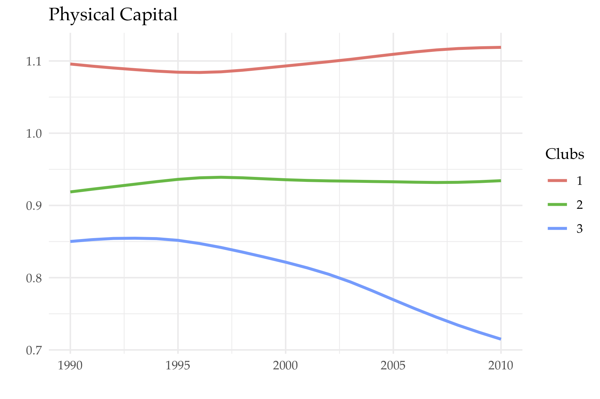

<style>
h1.title {font-size: 18pt; color: DarkBlue;} 
body, h1, h2, h3, h4 {font-family: "Palatino", serif;}
body {font-size: 12pt;}
/* Headers */
h1,h2,h3,h4,h5,h6{font-size: 14pt; color: #00008B;}
body {color: #333333;}
a, a:hover {color: #8B3A62;}
pre {font-size: 12px;}
</style>


```{r setup, include=FALSE}
knitr::opts_chunk$set(
  echo = FALSE,
  cache=TRUE,
  messages=FALSE,
  warning=FALSE)
library(tidyverse)
library(knitr)
library(kableExtra)
```

# Introduction

Write one sentence per line.
Leave one blank line to separate paragraphs. 
Write one sentence per line.
Leave one blank line to separate paragraphs.
Write one sentence per line.
Leave one blank line to separate paragraphs.

Regional inequality is a pervasive feature of the Indonesian economy [@esmara1975regional; @mishra2009economic; @bendesa2016].
To a large extent, the insular geography and the unbalanced spatial distribution of natural resources suggest that regional inequality is an expected outcome.
However, regional improvements in labor productivity may help reduce these regional imbalances and promote economic development.
Moreover, since the early 2000s, major political reforms such as decentralization and democratization initiatives may have influenced the trajectories of labor productivity and its proximate determinants: physical capital, human capital, and aggregate efficiency.

The results of this paper contribute to the literature of regional development in Indonesia in three fronts.
First, there is a large literature that studies provincial income disparities in Indonesia [@akita1988regional; @mishra2009economic; @akita2011structural].
To this literature, this paper contributes an evaluation of provincial disparities in some of the main determinants of per-capita income: labor productivity, physical capital, human capital and efficiency.^[By studying the determinants of income, this paper is also related to the literature that decomposes income differences into factors in Indonesia [@akitaLukman1995; @kataoka2010factor; @kataoka2018inequality].]
Second, there is a growing literature that studies provincial convergence with a focus on the dynamics of the "average" province that converges to a unique equilibrium [@garcia1998differences; @resosudarmo2006regional; @vidyattama2013regional].
To this literature, this paper provides an alternative perspective the goes beyond the dynamics of the average province.
Specifically, this paper incorporates the role of provincial heterogeneity and the formation of multiple convergence clubs (multiple equilibria).
Third, there is an emerging literature that studies provincial convergence in Indonesia from a convergence clubs perspective [@gunawan2019provinces; @kurniawan2019poor; @mendez2020efficiencyConvergence].
To this literature, this paper contributes a more comprehensive evaluation of productivity-related indicators.^[The papers of @sakamoto2007 and @gunawan2019provinces, for instance,  only focus on income, while the paper of @mendez2019efficiencyIndonesia only focuses on efficiency. Although @kurniawan2019poor evaluate four different socio-economic indicators, they do not include the dynamics of labor productivity, physical capital, and efficiency, which are the main indicators of the current paper.]

The rest of this paper is organized as follows.
Section 2 provides an overview of the related literature.
Section 3 describes the data and documents a set of stylized facts.
Section 4 presents the methodological approach of the paper.
Section 5 discusses the results.
Finally, Section 6 offers some concluding remarks.

# Related literature

## Two established literatures: Productivity accounting and convergence

At least since the seminal contribution of @solow1956contribution, the study economic growth has emphasized the role of capital accumulation and aggregate efficiency (technological progress) for understanding labor productivity differences across countries and over time.


## Other subsection


# Data and stylized facts

## Data construction and descriptive statistics

Data of 26 provinces over the 1990-2010 period are used to measure labor productivity and its proximate sources: capital accumulation and aggregate efficiency
Based on publicly available information from the Central Bureau of Statistics of Indonesia, labor productivity is constructed by dividing real Gross Regional Domestic Product (GRDP) by the number of workers in the labor force.
Based on the same data source, human capital per worker is constructed as a weighted average of the years of education of the labor force.
Based on the physical capital stock estimates of @kataoka2013capital, physical capital per worker is constructed by dividing provincial capital stock by the number of workers in the labor force.

## Other subsection

# Methodology

## Convergence framework

@phillips2007transition proposed a convergence test based on the decomposition of panel data.
Consider a variable, $y_{it}$, that can be decomposed as follows:
\begin{equation}
y_{it}=g_{it}+a_{it},
\label{eq:panel-data}
\end{equation}
where $g_{it}$ is a systematic component and $a_{it}$ is a transitory component.
To further separate common from idiosyncratic components, Equation \ref{eq:panel-data} is restated as follows:
\begin{equation}
y_{it}=\left(\frac{g_{it}+a_{it}}{\mu_{t}}\right)\mu_{t}=\delta_{it}\mu_{t},
\label{eq:factor-model}
\end{equation}
where $\delta_{it}$ is an idiosyncratic component and $\mu_{t}$ is a common component.

Intuitively, $\delta_{it}$ describes the transition path of each economy towards its own equilibrium growth path and $\mu_{t}$ describes a hypothesized equilibrium growth path that is common to all economies.
More formally, Equation \ref{eq:factor-model} is a dynamic factor model where the idiosyncratic component, $\delta_{it}$, is a factor-loading coefficient that represents the individual distance between a common trending behavior, $\mu_{t}$, and the observed variable, $y_{it}$.

Next, the following semi-parametric specification is suggested by @phillips2007transition and @phillips2009economic to characterize the dynamics of the idiosyncratic component, $\delta_{it}$:
\begin{equation}
\delta_{it}=\delta_{i}+\frac{\sigma_{i}\xi_{it}}{log\left(t\right)t^{\alpha}},
\label{eq:semiparametric}
\end{equation}
where $\delta_{i}$ is constant over time but varies across economies, $\xi_{it}$ is a weakly time dependent process with mean 0 and variance 1 across economies.


Specifically, a one-sided t test with heteroskedasticity-autocorrelation consistent (HAC) standard  errors is used.
In this setting, the null hypothesis of convergence is rejected when $t_{b} < -1.65$.

## Other subsection


# Results

The log t test of convergence suggested by @phillips2007transition rejects the convergence hypothesis for labor productivity.

This is a figure that is nativaly created in this document using R

```{r codeChunkName, fig.cap="Title of the figure", out.width="70%", fig.align='center'}
ggplot(cars) +
  aes(x = speed, y = dist) +
  geom_point()
```

Write one sentence per line.
Leave one blank line to separate paragraphs. 
Write one sentence per line.
Leave one blank line to separate paragraphs.
Write one sentence per line.
Leave one blank line to separate paragraphs.

This is a table that is natively created in this document using R


```{r}
cars %>% 
  head(5) %>% 
  kable(caption = "A knitr kable table") %>% 
  kable_styling()
```


This table is imported from a csv file

```{r message=FALSE, warning=FALSE}
tab1 <- read_csv("other-tabs/skim2010-nicer.csv")
tab1 %>% 
  kable(caption = "An imported table") %>% 
  kable_styling()
  
```


Here I add a PNG figure from the results folder

```{r codeChunkName2, fig.cap="Figure from png", out.width="70%", fig.align='center'}

```


# Concluding remarks

This paper studies the evolution of provincial disparities in labor productivity, physical and human capital accumulation per worker, and aggregate efficiency in Indonesia over the 1990-2010 period.
In particular, the convergence test proposed by  @phillips2007transition is applied to evaluate whether all provinces are converging to a common steady-state path.
The results are three fold.
First, there is a lack of overall convergence in labor productivity and two convergence clubs characterize its provincial dynamics.
Second, the hypothesis of overall convergence is also rejected for both capital inputs.
Physical and human capital per worker are characterized by three and two convergence clubs, respectively.
Third, aggregate efficiency is the only production variable for which the convergence hypothesis is not rejected.


\newpage

# Appendix {-}

## A) Convergence clubs using a common Y axis {-}

### Labor productivity {-}


### Physical capital per worker {-}


\newpage

## B) Initial (before merge) convergence clubs of physical capital per worker {-}


\newpage

# References {-}
