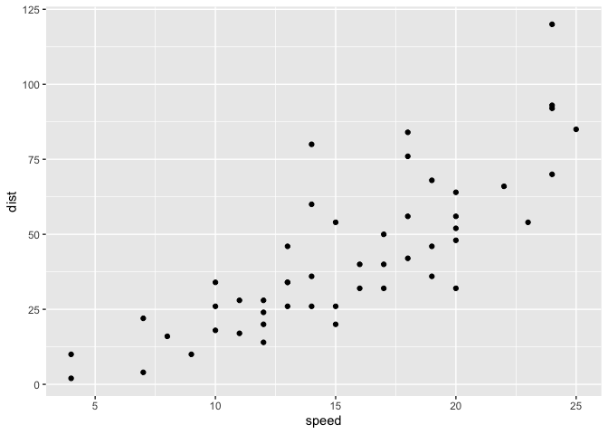

TitleHere
================
true

# Introduction

Write one sentence per line. Leave one blank line to separate
paragraphs. Write one sentence per line. Leave one blank line to
separate paragraphs. Write one sentence per line. Leave one blank line
to separate paragraphs.

Regional inequality is a pervasive feature of the Indonesian economy
(Esmara 1975; Mishra 2009; Bendesa et al. 2016). To a large extent, the
insular geography and the unbalanced spatial distribution of natural
resources suggest that regional inequality is an expected outcome.
However, regional improvements in labor productivity may help reduce
these regional imbalances and promote economic development. Moreover,
since the early 2000s, major political reforms such as decentralization
and democratization initiatives may have influenced the trajectories of
labor productivity and its proximate determinants: physical capital,
human capital, and aggregate efficiency.

The results of this paper contribute to the literature of regional
development in Indonesia in three fronts. First, there is a large
literature that studies provincial income disparities in Indonesia
(Akita 1988; Mishra 2009; Akita, Kurniawan, and Miyata 2011). To this
literature, this paper contributes an evaluation of provincial
disparities in some of the main determinants of per-capita income: labor
productivity, physical capital, human capital and efficiency.\[1\]
Second, there is a growing literature that studies provincial
convergence with a focus on the dynamics of the “average” province that
converges to a unique equilibrium (Garcia and Soelistianingsih 1998;
Resosudarmo and Vidyattama 2006; Vidyattama 2013). To this literature,
this paper provides an alternative perspective the goes beyond the
dynamics of the average province. Specifically, this paper incorporates
the role of provincial heterogeneity and the formation of multiple
convergence clubs (multiple equilibria). Third, there is an emerging
literature that studies provincial convergence in Indonesia from a
convergence clubs perspective (Gunawan, Mendez, and Santos-Marquez 2019;
Kurniawan, Groot, and Mulder 2019; Mendez 2020). To this literature,
this paper contributes a more comprehensive evaluation of
productivity-related indicators.\[2\]

The rest of this paper is organized as follows. Section 2 provides an
overview of the related literature. Section 3 describes the data and
documents a set of stylized facts. Section 4 presents the methodological
approach of the paper. Section 5 discusses the results. Finally, Section
6 offers some concluding remarks.

# Related literature

## Two established literatures: Productivity accounting and convergence

At least since the seminal contribution of Solow (1956), the study
economic growth has emphasized the role of capital accumulation and
aggregate efficiency (technological progress) for understanding labor
productivity differences across countries and over time.

## Other subsection

# Data and stylized facts

## Data construction and descriptive statistics

Data of 26 provinces over the 1990-2010 period are used to measure labor
productivity and its proximate sources: capital accumulation and
aggregate efficiency Based on publicly available information from the
Central Bureau of Statistics of Indonesia, labor productivity is
constructed by dividing real Gross Regional Domestic Product (GRDP) by
the number of workers in the labor force. Based on the same data source,
human capital per worker is constructed as a weighted average of the
years of education of the labor force. Based on the physical capital
stock estimates of Kataoka (2013), physical capital per worker is
constructed by dividing provincial capital stock by the number of
workers in the labor force.

## Other subsection

# Methodology

## Convergence framework

Phillips and Sul (2007) proposed a convergence test based on the
decomposition of panel data. Consider a variable, \(y_{it}\), that can
be decomposed as follows:  where \(g_{it}\) is a systematic component
and \(a_{it}\) is a transitory component. To further separate common
from idiosyncratic components, Equation  is restated as follows:  where
\(\delta_{it}\) is an idiosyncratic component and \(\mu_{t}\) is a
common component.

Intuitively, \(\delta_{it}\) describes the transition path of each
economy towards its own equilibrium growth path and \(\mu_{t}\)
describes a hypothesized equilibrium growth path that is common to all
economies. More formally, Equation  is a dynamic factor model where the
idiosyncratic component, \(\delta_{it}\), is a factor-loading
coefficient that represents the individual distance between a common
trending behavior, \(\mu_{t}\), and the observed variable, \(y_{it}\).

Next, the following semi-parametric specification is suggested by
Phillips and Sul (2007) and Phillips and Sul (2009) to characterize the
dynamics of the idiosyncratic component, \(\delta_{it}\):  where
\(\delta_{i}\) is constant over time but varies across economies,
\(\xi_{it}\) is a weakly time dependent process with mean 0 and variance
1 across economies.

Specifically, a one-sided t test with heteroskedasticity-autocorrelation
consistent (HAC) standard errors is used. In this setting, the null
hypothesis of convergence is rejected when \(t_{b} < -1.65\).

## Other subsection

# Results

The log t test of convergence suggested by Phillips and Sul (2007)
rejects the convergence hypothesis for labor productivity.

This is a figure that is nativaly created in this document using
R

Title of the figure

Write one sentence per line. Leave one blank line to separate
paragraphs. Write one sentence per line. Leave one blank line to
separate paragraphs. Write one sentence per line. Leave one blank line
to separate paragraphs.

This is a table that is natively created in this document using R

| speed | dist |
| ----: | ---: |
|     4 |    2 |
|     4 |   10 |
|     7 |    4 |
|     7 |   22 |
|     8 |   16 |

A knitr kable table

This table is imported from a csv
file

| X1                           |  Mean | Std. Dev. |    Min | Median |    Max |
| :--------------------------- | ----: | --------: | -----: | -----: | -----: |
| Scale 1: Original values     |    NA |        NA |     NA |     NA |     NA |
| Labor productivity           | 19.09 |     16.82 |   5.89 |  14.35 |  75.03 |
| Physical capital             | 42.39 |     48.67 |  11.13 |  27.27 | 248.79 |
| Human capital                |  7.91 |      0.99 |   5.27 |   7.95 |  10.42 |
| Efficiency (parametric)      |  1.33 |      0.57 |   0.73 |   1.21 |   3.35 |
| Efficiency (nonparametric)   | 77.13 |     17.76 |  40.70 |  77.55 | 100.00 |
| Scale 2: Relative log trends |    NA |        NA |     NA |     NA |     NA |
| Labor productivity           |  1.00 |      0.22 |   0.64 |   0.96 |   1.59 |
| Physical capital             |  1.00 |      0.21 |   0.70 |   0.96 |   1.61 |
| Human capital                |  1.00 |      0.06 |   0.82 |   1.01 |   1.14 |
| Efficiency (parametric)      |  1.00 |      1.52 | \-1.33 |   0.82 |   5.38 |
| Efficiency (nonparametric)   |  1.00 |      0.06 |   0.86 |   1.01 |   1.07 |

An imported table

Here I add a PNG figure from the results
folder

Figure from png

# Concluding remarks

This paper studies the evolution of provincial disparities in labor
productivity, physical and human capital accumulation per worker, and
aggregate efficiency in Indonesia over the 1990-2010 period. In
particular, the convergence test proposed by Phillips and Sul (2007) is
applied to evaluate whether all provinces are converging to a common
steady-state path. The results are three fold. First, there is a lack of
overall convergence in labor productivity and two convergence clubs
characterize its provincial dynamics. Second, the hypothesis of overall
convergence is also rejected for both capital inputs. Physical and human
capital per worker are characterized by three and two convergence clubs,
respectively. Third, aggregate efficiency is the only production
variable for which the convergence hypothesis is not
rejected.

# Appendix

## A) Convergence clubs using a common Y axis

### Labor productivity

### Physical capital per worker

## B) Initial (before merge) convergence clubs of physical capital per worker

# References

Akita, Takahiro. 1988. “Regional Development and Income Disparities in
Indonesia.” *Asian Economic Journal* 2 (2). Wiley Online Library:
165–91.

Akita, Takahiro, Puji Agus Kurniawan, and Sachiko Miyata. 2011.
“Structural Changes and Regional Income Inequality in Indonesia: A
Bidimensional Decomposition Analysis.” *Asian Economic Journal* 25 (1).
Wiley Online Library: 55–77.

Akita, Takahiro, and Rizal Affandi Lukman. 1995. “Interregional
Inequalities in Indonesia: A Sectoral Decomposition Analysis for
1975–92.” *Bulletin of Indonesian Economic Studies* 31 (2). Taylor &
Francis: 61–81.

Bendesa, I Komang Gde, Luh Gede Meydianawathi, Hefrizal Handra, D.S.
Priyarsono Djoni Hartono, Budy P. Resosudarmo, and Arief A. Yusuf. 2016.
*Tourism and Sustainable Regional Development*. Bandung: Padjadjaran
University Press.

Esmara, Hendra. 1975. “Regional Income Disparities.” *Bulletin of
Indonesian Economic Studies* 11 (1). Taylor & Francis: 41–57.

Garcia, Jorge Garcia, and Lana Soelistianingsih. 1998. “Why Do
Differences in Provincial Incomes Persist in Indonesia?” *Bulletin of
Indonesian Economic Studies* 34 (1). Taylor & Francis: 95–120.

Gunawan, Anang, Carlos Mendez, and Felipe Santos-Marquez. 2019.
“Regional Income Disparities, Distributional Convergence, and Spatial
Effects: Evidence from Indonesia.” MPRA Working Paper 95972. University
Library of Munich, Germany.
<https://ideas.repec.org/p/pra/mprapa/97090.html>.

Kataoka, Mitsuhiko. 2010. “Factor Decomposition of Interregional Income
Inequality Before and After Indonesia’s Economic Crisis.” *Studies in
Regional Science* 40 (4). JAPAN SECTION OF THE REGIONAL SCIENCE
ASSOCIATION INTERNATIONAL: 1061–72.

———. 2013. “Capital Stock Estimates by Province and Interprovincial
Distribution in Indonesia.” *Asian Economic Journal* 27 (4). Wiley
Online Library: 409–28.

———. 2018. “Inequality Convergence in Inefficiency and Interprovincial
Income Inequality in Indonesia for 1990–2010.” *Asia-Pacific Journal of
Regional Science* 2 (2). Springer: 297–313.

Kurniawan, Hengky, Henri LF de Groot, and Peter Mulder. 2019. “Are Poor
Provinces Catching-up the Rich Provinces in Indonesia?” *Regional
Science Policy & Practice* 11 (1). Wiley Online Library: 89–108.

Mendez, Carlos. 2019. “Regional Efficiency Dispersion, Convergence, and
Efficiency Clusters: Evidence from the Provinces of Indonesia
1990-2010.” MPRA Working Paper 97090. University Library of Munich,
Germany. <https://ideas.repec.org/p/pra/mprapa/95972.html>.

———. 2020. “Regional Efficiency Convergence and Efficiency Clusters:
Evidence from the Provinces of Indonesia 1990–2010.” *Asia-Pacific
Journal of Regional Science* https://doi.org/10.1007/s41685-020-00144-w.
Springer.

Mishra, Satish Chandra. 2009. “Economic Inequality in Indonesia: Trends,
Causes and Policy Response.” *Colombo, UNDP Regional Office*.

Phillips, Peter CB, and Donggyu Sul. 2007. “Transition Modeling and
Econometric Convergence Tests.” *Econometrica* 75 (6). Wiley Online
Library: 1771–1855.

———. 2009. “Economic Transition and Growth.” *Journal of Applied
Econometrics* 24 (7). Wiley Online Library: 1153–85.

Resosudarmo, Budy P, and Yogi Vidyattama. 2006. “Regional Income
Disparity in Indonesia: A Panel Data Analysis.” *ASEAN Economic
Bulletin*. JSTOR, 31–44.

Sakamoto, Hiroshi. 2007. “The Dynamics of Inter-Provincial Income
Distribution in Indonesia.” *The International Centre for the Study of
East Asian Development* Working Paper 2007-25.

Solow, Robert M. 1956. “A Contribution to the Theory of Economic
Growth.” *The Quarterly Journal of Economics* 70 (1). MIT Press:
65–94.

Vidyattama, Yogi. 2013. “Regional Convergence and the Role of the
Neighbourhood Effect in Decentralised Indonesia.” *Bulletin of
Indonesian Economic Studies* 49 (2). Taylor & Francis: 193–211.

1.  By studying the determinants of income, this paper is also related
    to the literature that decomposes income differences into factors in
    Indonesia (Akita and Lukman 1995; Kataoka 2010, 2018).

2.  The papers of Sakamoto (2007) and Gunawan, Mendez, and
    Santos-Marquez (2019), for instance, only focus on income, while the
    paper of Mendez (2019) only focuses on efficiency. Although
    Kurniawan, Groot, and Mulder (2019) evaluate four different
    socio-economic indicators, they do not include the dynamics of labor
    productivity, physical capital, and efficiency, which are the main
    indicators of the current paper.
